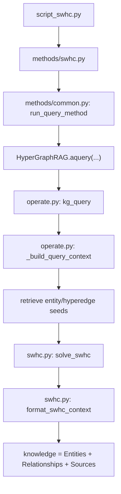

# SWHC 方法设计与实现说明

## 1. 方法定位

`Semantic Wiener HyperConnector (SWHC)` 是在 `HyperGraphRAG` 基础上实现的一个 **query-time 证据子图组装器**。它不改动文档切块、实体/超边抽取、超图存储和向量索引的建图流程，而是在查询阶段替换原始 `HyperGraphRAG` 的“邻域并集式上下文组装”逻辑。

目标很明确：

- 保留 `HyperGraphRAG` 对 n-ary fact 的表达能力
- 用一个更紧凑、更低冗余、更面向生成的子图选择目标替换启发式拼接
- 在相同或更小的上下文预算下，提升多跳问题的证据组织质量

一句话概括：

> HyperGraphRAG 解决了“如何表示 n-ary facts”，SWHC 进一步解决“如何把 query 相关事实组装成一个适合生成的证据子图”。

---

## 2. 与 HyperGraphRAG 的关系

### 2.1 不变的部分

SWHC 继承了 HyperGraphRAG 的整个建图阶段：

1. 原始文档读入
2. chunk 切分
3. LLM 抽取实体与 hyperedge
4. 用二部图表示超图
5. 建立三个索引：
   - `chunks_vdb`
   - `entities_vdb`
   - `hyperedges_vdb`

这些逻辑仍然由以下代码负责：

- 基线主类：`D:\PythonProjects\HyperGraphRAG\evaluation\hypergraphrag\hypergraphrag.py`
- 建图/查询主逻辑：`D:\PythonProjects\HyperGraphRAG\evaluation\hypergraphrag\operate.py`

### 2.2 改动的部分

SWHC 只改 **查询阶段的上下文组装**：

- 原始 `HyperGraphRAG`：local/global 检索后，做邻域扩展和上下文拼接
- `SWHC`：先召回 seeds，再在候选子图上求一个语义加权的连接子图，最后从这个子图导出 `Entities / Relationships / Sources`

对应的查询入口参数是：

- `QueryParam(only_need_context=True, subgraph_selector="swhc")`

实际评测脚本入口：

- `D:\PythonProjects\HyperGraphRAG\evaluation\methods\swhc.py`
- 兼容脚本：`D:\PythonProjects\HyperGraphRAG\evaluation\script_swhc.py`

---

## 3. 运行时实际生效的代码位置

仓库里有两套实现：

1. 根目录包：`D:\PythonProjects\HyperGraphRAG\hypergraphrag\...`
2. 评测包：`D:\PythonProjects\HyperGraphRAG\evaluation\hypergraphrag\...`

**评测与论文复现时真正生效的是第 2 套，即 `evaluation/hypergraphrag/`。**

因此，理解和修改 SWHC 时，优先看下面这些文件：

- 方法入口：`D:\PythonProjects\HyperGraphRAG\evaluation\methods\swhc.py`
- 查询公用入口：`D:\PythonProjects\HyperGraphRAG\evaluation\methods\common.py`
- 查询主链：`D:\PythonProjects\HyperGraphRAG\evaluation\hypergraphrag\operate.py`
- SWHC 核心实现：`D:\PythonProjects\HyperGraphRAG\evaluation\hypergraphrag\swhc.py`
- 查询参数定义：`D:\PythonProjects\HyperGraphRAG\evaluation\hypergraphrag\base.py`

---

## 4. 查询阶段的整体流程

### 4.1 调用链

SWHC 的调用路径如下：

### 4.2 每步做什么

1. `methods/swhc.py` 指定这是 `SWHC` 方法，并构造：
   - `QueryParam(only_need_context=True, subgraph_selector="swhc")`
2. `methods/common.py` 负责：
   - 加载数据集问题
   - 创建 `HyperGraphRAG` 实例
   - 并发调用 `rag.aquery(question, query_param)`
3. `operate.py` 中的 `kg_query` 先做 query 抽取和种子召回
4. `_build_query_context` 检测到 `subgraph_selector == "swhc"`
5. 调 `solve_swhc(...)` 选择证据子图
6. 调 `format_swhc_context(...)` 把子图转换成最终上下文字符串

---

## 5. SWHC 的方法设计

## 5.1 输入对象

SWHC 在查询阶段接收两类 seed：

- `entity seeds`
- `hyperedge seeds`

这两类种子仍由 HyperGraphRAG 的原始检索链提供，而不是 SWHC 自己重新召回。因此 SWHC 的职责不是“替代召回”，而是“替代召回后的上下文组装”。

## 5.2 terminals 的定义

SWHC 不把 terminal 只定义成实体，而是把以下节点都视作可能的重要终端：

- 高分实体节点
- 高分 hyperedge 节点

这比传统 entity-only connector 更适合 HyperGraphRAG，因为 HyperGraphRAG 的核心知识单元本来就是 hyperedge。

## 5.3 候选子图

SWHC 不直接在全图上做优化，而是先从 seeds 出发构造候选子图：

- 从 seed 节点向外做 `hops` 跳 BFS
- 收集访问到的节点和边
- 形成一个局部候选图 `C_q`

这一步在代码里由：

- `build_candidate_subgraph(...)`

完成。

设计动机：

- 避免在全局图上做昂贵搜索
- 保留 query 局部相关结构
- 便于后续做更快的 connector 构造

## 5.4 语义加权

SWHC 不是只看结构距离，还给节点和路径加上语义偏置。

### 节点分数

节点分数由 `_derive_node_scores(...)` 计算：

- 对实体节点，主要考虑：
  - 它是否是高分 seed
  - 它的图度
- 对 hyperedge 节点，主要考虑：
  - seed 分数
  - hyperedge 自身的 `weight`
  - 节点度

设计直觉：

- 被 query 明确命中的节点，优先级更高
- 能桥接多个事实的节点，也更值得进入子图
- hyperedge 自身的质量不能被忽略

### 边权重

`_add_semantic_edge_weights(...)` 会在候选图边上写入 `swhc_weight`，综合考虑：

- 原始边 `weight`
- 两端节点的语义分数

这样得到的最短路，不再是单纯的 hop 最短路，而是更偏向：

- 经过高语义相关节点的路径
- 避开语义弱、结构噪声大的路径

## 5.5 目标函数思想

SWHC 的实现是一个 practical heuristic version，不追求完全复现 MWC 论文里的理论近似过程。

但它仍然保留了“**更紧凑的 terminal 连接子图更好**”这条主线。具体通过以下三项来近似：

1. `wiener` 项：terminal 间在子图中的加权距离
2. `node_cost` 项：节点 token 成本 + 语义惩罚
3. `size_penalty` 项：控制子图规模

对应代码：

- `_compute_objective(...)`

总分由这些参数控制：

- `swhc_alpha`
- `swhc_beta`
- `swhc_gamma`

---

## 6. SWHC 的核心算法阶段

## 6.1 初始连接子图

函数：

- `_initialize_connector_subgraph(...)`

做法：

1. 用候选图上 terminal 两两最短路，构造一个 terminal 完全图
2. 在 terminal 完全图上求 MST
3. 把 MST 对应的原图路径拷回，作为初始连接子图

这一步的作用是：

- 先得到一个一定连通的、比“邻域并集”更紧的骨架子图

## 6.2 bridge augmentation

函数：

- `_augment_connector_subgraph(...)`

做法：

1. 找当前子图里 terminal 间距离最大的若干 terminal pair
2. 回到候选图里找它们的更优语义最短路
3. 如果加入这条 path 能降低总目标值，就接受
4. 迭代直到：
   - 收益低于阈值
   - 或达到节点预算
   - 或达到最大迭代轮数

核心参数：

- `swhc_bridge_max_iters`
- `swhc_min_gain`
- `swhc_budget_nodes`

设计直觉：

- 初始 connector 可能已经连通，但还不够紧凑
- 有些桥接路径能显著缩短 terminal 之间的有效距离
- 这一步就是把“更像 reasoning chain 的桥接结构”补进来

## 6.3 pruning

函数：

- `_prune_connector_subgraph(...)`

做法：

- 尝试删除非-terminal 的叶子节点
- 如果删掉后目标更优，就删除

作用：

- 清理 augmentation 带来的尾部冗余
- 让最终子图更小、更适合生成

---

## 7. 从子图导出最终上下文

函数：

- `format_swhc_context(...)`

它会把子图转成三部分：

1. `Entities`
2. `Relationships`
3. `Sources`

### 7.1 Entities

从子图里取：

- `role == entity` 的节点

排序依据：

- 节点分数
- 节点度

然后按 `max_token_for_local_context` 做截断。

### 7.2 Relationships

从子图里取：

- `role == hyperedge` 的节点

并列出它关联的实体集合，再按 `max_token_for_global_context` 截断。

### 7.3 Sources

从子图节点中回收 `source_id`，映射回原始 chunk，去重后按 token budget 截断。

这一步非常关键，因为：

- 生成模型最终真正读到的是文本证据
- SWHC 选出的结构化子图，最终要落到文本上下文上

也正因为如此，SWHC 是一个 **evidence assembly module**，不是一个纯图算法替代品。

---

## 8. 关键参数说明

SWHC 的关键参数定义在：

- `D:\PythonProjects\HyperGraphRAG\evaluation\hypergraphrag\base.py`

当前主要参数包括：

- `subgraph_selector: Literal["union", "swhc", "graphrag"] = "union"`
- `swhc_candidate_hops: int = 2`
- `swhc_seed_topk_entity: int = 8`
- `swhc_seed_topk_hyperedge: int = 8`
- `swhc_hard_terminal_topk: int = 8`
- `swhc_alpha: float = 1.0`
- `swhc_beta: float = 0.15`
- `swhc_gamma: float = 0.05`
- `swhc_bridge_max_iters: int = 20`
- `swhc_min_gain: float = 1e-3`
- `swhc_enable_prune: bool = True`
- `swhc_budget_nodes: int = 80`
- `swhc_return_debug: bool = False`

建议的理解方式：

- `candidate_hops`：候选图范围
- `seed_topk_*`：前置召回多少个 seed 参与 SWHC
- `hard_terminal_topk`：真正要求重点连接的 terminals 数量
- `alpha/beta/gamma`：结构紧凑性、内容成本、图规模三项的平衡
- `bridge_*`：控制 augmentation 强度
- `budget_nodes`：控制最终上下文不会膨胀

---

## 9. 与 HyperGraphRAG 原始组装方式的差异

### HyperGraphRAG 原始做法

- 从检索结果出发
- 做 local/global 邻域扩展
- 合并 `Entities / Relationships / Sources`

优点：

- 实现简单
- 覆盖面大

缺点：

- 没有显式优化目标
- 容易把太多相关但不必要的节点一起带进来
- 多跳问题下，证据图未必紧凑

### SWHC 做法

- 保留前置召回
- 但对召回结果构造候选图
- 在候选图上显式选择一个更紧凑的连接子图
- 最后从这个子图导出上下文

优点：

- 上下文更可控
- 更容易压缩 token
- 更接近“把事实链组装出来”而不是“把邻域都拼起来”

已在 `hypertension` 上观察到的现象是：

- 平均上下文规模明显缩小
- `EM / F1 / R-Sim` 优于原始 HyperGraphRAG
- `3-hop` 问题提升更明显

---

## 10. 代码入口速查

### 10.1 方法入口

- `D:\PythonProjects\HyperGraphRAG\evaluation\methods\swhc.py`

作用：

- 为评测脚本指定 `method_name="SWHC"`
- 构造 `QueryParam(only_need_context=True, subgraph_selector="swhc")`

### 10.2 查询调度

- `D:\PythonProjects\HyperGraphRAG\evaluation\methods\common.py`

作用：

- 加载 `questions.json`
- 实例化 `HyperGraphRAG`
- 并发执行 `aquery`
- 保存 `test_knowledge.json`

### 10.3 查询主链

- `D:\PythonProjects\HyperGraphRAG\evaluation\hypergraphrag\operate.py`

作用：

- 承担 query 抽取、缓存、种子召回、上下文组装
- 当 `subgraph_selector == "swhc"` 时，进入 SWHC 分支

### 10.4 SWHC 核心实现

- `D:\PythonProjects\HyperGraphRAG\evaluation\hypergraphrag\swhc.py`

核心函数：

- `build_candidate_subgraph(...)`
- `solve_swhc(...)`
- `format_swhc_context(...)`

---

## 11. 输出与评测兼容性

SWHC 的输出仍然是一个与基线兼容的 `knowledge` 字符串，因此：

- `Step3` 生成脚本可以直接复用
- `Step4` 打分脚本可以直接复用
- `Step5` 汇总脚本可以直接复用

输出位置：

- `D:\PythonProjects\HyperGraphRAG\evaluation\results\SWHC\<dataset>\test_knowledge.json`

这也是为什么 SWHC 很适合在现有 HyperGraphRAG 代码库上增量实现：

- 它不重写评测协议
- 只替换 retrieval-to-context 这一步

---

## 12. 当前实现的边界与限制

### 12.1 不是理论近似复现版

当前版本是 **practical heuristic implementation**，不是对 MWC 原论文近似算法的严格复现。它更偏向：

- 工程可运行
- 容易对照实验
- 易于做 ablation

### 12.2 仍依赖远程 LLM

虽然图索引和 SWHC 本身是本地可执行的，但当前查询链仍依赖：

- query 抽取
- 生成
- 评分 judge

这些环节会走远程 LLM。当前仓库已经支持：

- 实时推理后端
- 批量推理后端

但如果远程 API key 不可用，实际查询仍会被阻塞。此前真实运行中，统一遇到过：

- `403 invalid user v2`

所以要区分两件事：

- **代码是否可运行**：可以
- **当前环境能否在线跑通**：受外部 API 权限影响

### 12.3 仍有可继续优化的点

下一步可继续做的方向包括：

1. 更强的 terminal 选择策略
2. soft terminal / prize-collecting 版本
3. 更精细的 token cost 建模
4. 把 edge confidence、chunk support 等因素更系统地并入目标函数
5. 增加更多 debug / 可解释性输出

---

## 13. 推荐阅读顺序

如果要快速上手这部分代码，建议按这个顺序读：

1. `D:\PythonProjects\HyperGraphRAG\evaluation\methods\swhc.py`
   - 先看入口怎么触发
2. `D:\PythonProjects\HyperGraphRAG\evaluation\methods\common.py`
   - 看一条 query 是怎么被批量执行的
3. `D:\PythonProjects\HyperGraphRAG\evaluation\hypergraphrag\operate.py`
   - 看 SWHC 是在哪个分支被接进去的
4. `D:\PythonProjects\HyperGraphRAG\evaluation\hypergraphrag\swhc.py`
   - 重点看 `solve_swhc(...)` 和 `format_swhc_context(...)`
5. `D:\PythonProjects\HyperGraphRAG\evaluation\hypergraphrag\base.py`
   - 最后看可调参数

这样理解成本最低，也最接近真实运行链路。

---

## 14. 总结

SWHC 不是重新定义 HyperGraphRAG，而是把它从：

- “能表示 n-ary facts 的超图检索器”

推进成：

- “能把 query 相关事实组装成紧凑证据子图的超图 RAG 系统”

它的核心价值在于：

- 不改变建图阶段
- 只改最关键的 query-time evidence assembly
- 与现有评测和生成链完全兼容
- 方便做和 HyperGraphRAG 的直接对照实验

从工程角度看，SWHC 是一个低侵入、可复用、易扩展的增强模块；从研究角度看，它把 HyperGraphRAG 的优势从“结构表示”进一步推进到了“结构化证据组装”。

